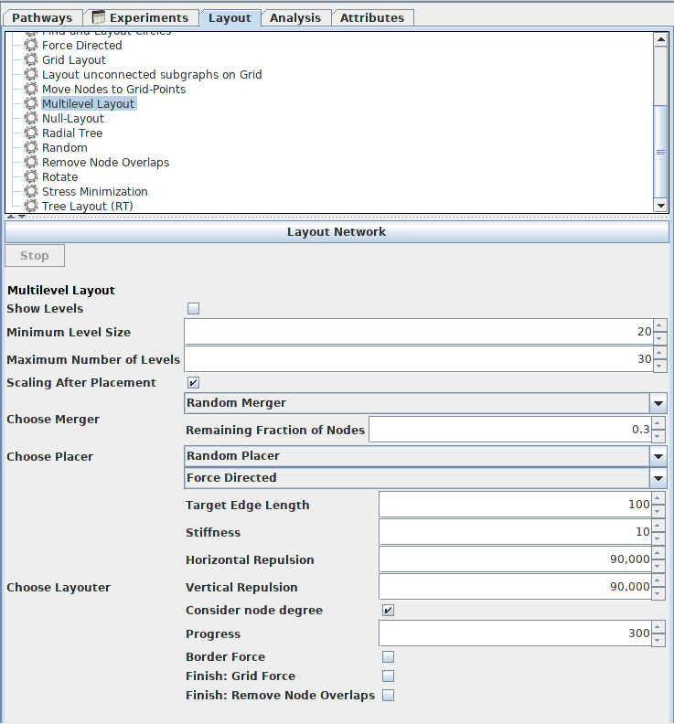
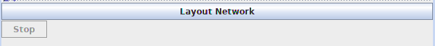
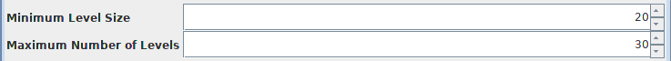
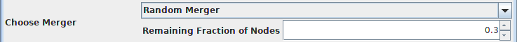
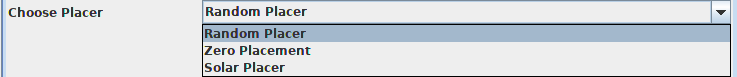
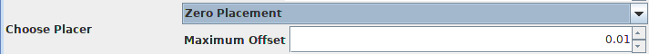
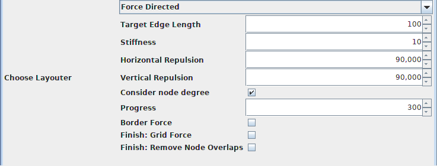
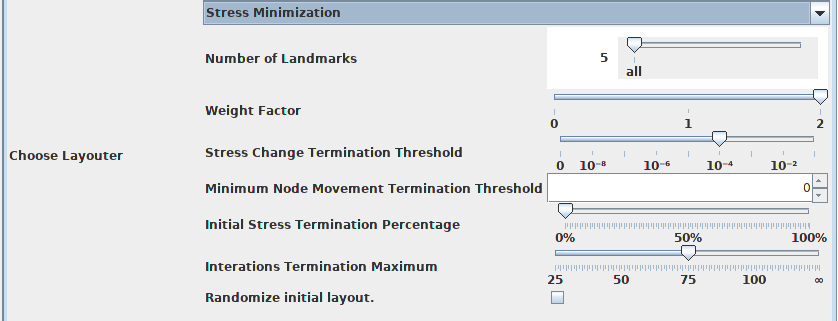
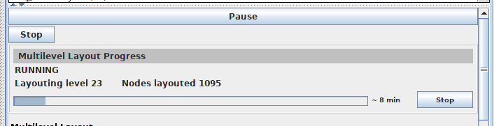
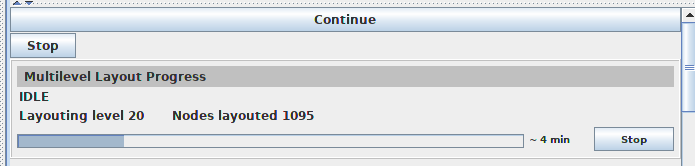

# Getting Started VANTED Multilevel Framework Add-on

## Overview
The Multilevel Framework Add-on is a framework for the open-source Java-based software [VANTED](https://www.cls.uni-konstanz.de/software/vanted/) to provides layouting large graphs. The framework consists of 3 parts: coarsening, placement and layouting. For each part the user is able to choose an algorithm and then execute the framework. 

## Integrate Multilevel Framework to VANTED
VANTED can be started for development with specified Add-on by starting the class StartVantedWithAddon.java in Eclipse.

For distribution generate jar-file under use of ant-script "createAdd-on.xml" (in Eclipse right-click and choose "Run As -> Ant Build").

Jar-files can be installed from users by starting VANTED, choosing menu bar "Edit -> Preferences", opening Addon-manager and  choosing "Install Add-on".

## Start working with the Multilevel Framework
To start working with the Multilevel Framework Add-on first a graph must be loaded in VANTED by choosing menu bar "File -> Open" or create a graph by choosing menu bar "File -> New" and then choose a network generator. After choosing a network generator and creating a graph, a new tab "Layout" appears in the sidepanel. Click on it and choose "Multilevel Layout". Now the Multilevel Framework can be used.

## Using the GUI
After the chapter "Start working with the Multilevel Framework" the sidepanel looking like the picture below



The button *Layout Network* executes the Multilevel Framework with the parameter below. The *Stop* button is only enable if the algorithm running. By pressing the *Stop* button the multilevel algorithm will be ended after execution of the actual running secondary algorithm. 



If *Show Levels* checked, at the end of the execution the algorithm outputs all levels the graph runs through during the execution. It is good to follow the development steps of the graph. By default, this is not checked.


The *Minimum Level Size* describes a termination criterion for the algorithm. This is the minimum number of nodes that may remain when merging nodes per level. The range of this parameter goes from 1 to 100.  By default, the value is 20 . The value should not be to large, because then it is possible to obtained a local good layout but not a global, and not to small, because then the number of levels grow.



The second termination criterion for the algorithm is the *Maximum Number of Levels*. This criterion is the maximum number of levels the algorithm merging nodes. The range goes from 1 to 100 and the default value is 30. To use smaller values make sense for smaller graphs and lager values if the graph is large.

If  the check box *Scaling After Placement* is checked then each graph layout level scaling automatically.  By default, this a parameter is checked. When some nodes and edges are selected and the elements  of the input graph which are not selected should be  on the same position then it is good to disable the parameter.


The *Choose Merger* parameter is the algorithm which is used to merging nodes until the termination criterion is reached. Standard merger algorithms in this add-on are the  *Random Merger*, , *Solar Merger* and *Matching Merger*.


The *Random Merger* (or Random Neighbor Coarsening) algorithm has an parameter called *Remaining Fraction of Nodes*. The algorithm randomly selects edges and merges the nodes on both ends of the edges until the number is reduced by  *Remaining Fraction of Nodes*. The range of the parameter goes from 0.01 to 1 and the default value is 0.3.



The *Solar Merger* algorithm have parameter called *sun probability* which is the probability that a particular node is a sun. The range goes form 0.01 to 1 and the default value is 0.5. The solar merger chooses suns randomly out of the nodes, assigns the other nodes as planets to their nearest sun then collapses the created solar systems into their respective sun.


The *Matching Merger* looks at all graph edges and merged two nodes if they are connected by an edge and both nodes are not part of a merged node.


With the *Choose Placer* parameter, the user choosing the algorithm which replace the nodes from the graph level above in the new graph level. Standard placement algorithms in this add-on are  *Random Placer*, *Zero Placement* and *Solar Placer*.



The *Random Placer* algorithm place each node randomly.

The *Zero Placement* algorithm has a parameter *Maximum Offset* which can be larger than 0. The algorithm place each node at the position of the parent node with a small random offset which can assume maximum the value of *Maximum Offset*. The default value of *Max Offset* is 0.01.



The *Solar Placer* algorithm places the nodes according to a solar-placement-algorithm. This Algorithm works only with the *Solar Merger* and execute the *Zero Placement* if another merger used.


The last parameter *Choose Layouter* is a layout algorithm which is executed on each graph level. Standard layout algorithms are all layout algorithm which are listed in the class LayoutersWhiteList. In this Add-on, the *Force Directed* and the *Stress Minimization* algorithm are in the list.


The *Force Directed* algorithm is a standard algorithm in VANTED and have following parameters:



The algorithm is based on the idea that edges represents springs and the nodes represents bullets which  have repulsion forces if they are too close to each other. For more information of the parameters and how the algorithm work in detail look up in the [API of VANTED](http://kim25.wwwdns.kim.uni-konstanz.de/vanted/javadoc/index.html?overview-summary.html).

The *Stress Minimization* algorithm is  described in gettingStarted.md for Stress Minimization with all parameters.



When the *Layout Network* button is pressed, then the button description changed to *Pause*. If the *Pause* button is pressed, the algorithm stops and the description of the button changes to *Continue*. If the *Continue* button is pressed, the the algorithm picks up where it left off.



During the execution of the algorithm, a progress bar and the status of the algorithm are shown below the stop button.




## Multilevel Graph

The primary data structure of the Multilevel Framework is the MultilevelGraph. The MultilevelGraph contains a list with graphs and a list with selections for each level. Level zero (list position zero) represents  the input graph or input selection. All graph levels have an attribute named MultilevelParentGraphAttribute which points to the graph level above. So it is possible to check the graph and the selection at the level above of a given graph level without using the whole multilevel graph. Furthermore each node in the graph list and in the selection list has an MultilevelParentNodeAttribute that points to the parent node in the level above. In addition the MultiLevelChildNodeAttribute save the number of child nodes and the MultilevelChildEdgeAttribute the number of child edges for each node. 


## Add new Coarsening Algorithm to Add-on

There are two options to create new coarsening or merging algorithm which are supported by the Multilevel Framework:

1. Implements interface CoarseningAlgorithm

   This approach is the more general and elaborate way to implement a new coarsening algorithm. Here is a example how a implementation of the null coarsening algorithm can look like with help of the CoarseningAlgorithm:

   ```java
   
   public class NewCoarseningAlgorithm implements CoarseningAlgorithm {
   	
   	private Graph g;
   	private Selection s;
   	
   	@Override
   	public String getName() {
   		// Name of the Algorithm
   		return "NewCoaresningAlgorithm";
   	}
       
       @Override
   	public void attach(Graph g, Selection selection) {
   		// Graph and selection from the multilevel graph level before
   		this.g = g;
   		this.s = selection;
   	}
       
   	@Override
   	public void execute() {
   		// create new graph and new selection for a new level the MultilevelGraph  
   		// attributes the coarsening algorithm will create
   		Object [] childObjects =(Object[]) (g.getAttribute(
               MultilevelParentGraphAttribute.FULLPATH).getValue());
   		Graph parentGraph = (Graph) childObjects[0];
   		Selection parentSelection = (Selection) childObjects[1];
   		
   		// add all nodes from graph g to the new graph parentGraph 
           // with the same label and same position
   		for(Node n: g.getNodes()) {
   			Node parent = parentGraph.addNode();
   			
   			// create new parent node for node n  
   			Attribute attr = new MultilevelParentNodeAttribute(
                   MultilevelParentNodeAttribute.NAME,parent);
   			// add attribute to node n with the information of the parent node 
   			AttributeHelper.setAttribute(n, MultilevelParentNodeAttribute.PATH,
   						MultilevelParentNodeAttribute.NAME, attr);
   			// set label and position of the parent node
   			AttributeHelper.setPosition(parent, AttributeHelper.getPosition(n));
   			AttributeHelper.setLabel(parent, AttributeHelper.getLabel(n, ""));
   		}
   		
   		// add edges to the parentGraph
   		for(Edge e: g.getEdges())
   		{
   			Node sparent = (Node) (e.getSource()).getAttribute(
                   MultilevelParentNodeAttribute.FULLPATH).getValue();
   			Node tparent = (Node) (e.getTarget())
                   .getAttribute(MultilevelParentNodeAttribute.FULLPATH).getValue();
   			parentGraph.addEdge(sparent, tparent, false);
   		}
   		
   		// multilevel works on selections so we select all graph elements 
           // for the next level
   		parentSelection.addAll(parentGraph.getGraphElements());
   	}
   
   	@Override
   	public void reset() {
   		// Reset of all attributes of the NewCoarseningClass
   		g = null;
   		s = null;
   	}
       
       @Override
   	public String getDescription() {
   		// Description of the new algorithm
   		return "A new null coarsening algorithm which merge no nodes";
   	}
   	
       /*
        * other methods to impelement
        */
       @Override
       public void setParameters(Parameter[] params) {}
   
   	@Override
   	public Parameter[] getParameters() {
   		return null;
   	}
   
   	@Override
   	public void check() throws PreconditionException {}
   
   
   	@Override
   	public String getCategory() {
   		return null;
   	}
   
   	@Override
   	public Set<Category> getSetCategory() {
   		return null;
   	}
   
   	@Override
   	public String getMenuCategory() {
   		return null;
   	}
   
   	@Override
   	public boolean isLayoutAlgorithm() { 
   		return false;
   	}
   
   	@Override
   	public boolean showMenuIcon() {
   		return false;
   	}
   
   	@Override
   	public KeyStroke getAcceleratorKeyStroke() {
   		return null;
   	}
       
   	@Override
   	public void setActionEvent(ActionEvent a) {}
   
   	@Override
   	public ActionEvent getActionEvent() {
   		return null;
   	}
   
   	@Override
   	public boolean mayWorkOnMultipleGraphs() {
   		return false;
   	}
   }
   ```
   
   

2. Implements abstract class AbstractCoarseningAlgorithm  

   This approach is more easier like to implement the CoarseningAlgorithm interface because the AbstractCoarseningAlgorithm class provides helper functions. The helper functions are listed in the API. An example for an Null Coarsening Algorithm with these approach looks like this:

   ```java
   public class NewCoarseningAlgorithm extends AbstractCoarseningAlgorithm {
   	@Override
   	public String getName() {
   		return "NewCoarseningAlgorithm";
   	}
   	
   	@Override
   	public void execute() {
           // create for each selected node a parent node
   		for(Node c :childSelection.getNodes())
   		{
   			createParent(Arrays.asList(c));
   		}
           // if there is a node which is not in the selection 
           // add a new parent node to the graph
   		if(childSelection.getNumberOfNodes()!=childGraph.getNumberOfNodes()) 
   		{
   			createParentNotSelectedNodes();
   		}
           // create edges between new nodes
   		createEdges();
   	}
   }
   ```
   After the implementation of the class the algorithm must add to the MultilevelFrameworkAddon class. Here is an example:

      ```java
      public class MultilevelFrameworkAddon extends AddonAdapter{
          @Override
          protected void initializeAddon() {
              this.algorithms = new Algorithm[] {
                      new NullCoarseningAlgorithm(),
                      new RandomCoarseningAlgorithm(), 
                      new RandomNeighborCoarseningAlgorithm(),
                      new RandomPlacementAlgorithm(),
                      new ZeroPlacementAlgorithm(),
                      new SolarMergerCoarsening(),
                      new SolarPlacement(),
                      new BackgroundExecutionAlgorithm(new MultilevelLayoutAlgorithm()),
                      new NullPlacementAlgorithm(),
                      new MatchingCoarseningAlgorithm(),
                      new NewCoarseningAlgorithm() // Add new coarsening algorithm
              };
              this.attributes = new Class[2];
              this.attributes[0] = MultilevelParentGraphAttribute.class;
              this.attributes[1] = MultilevelParentNodeAttribute.class;
      
              valueEditComponents.put(AlgorithmListParameter.class, AlgorithmListComponent.class);
          }
      }
      ```

## Add new Placement Algorithm to Add-on 

To implement a new placement algorithm, there are two approaches, too. These approaches are similar to the approaches of the coarsening algorithm implementation. 

1. Implement the interface PlacementAlgorithm

   In this approach the user must implements all functions for the algorithm manually. An implementation of the zero placement can look like:

   ```java
   public class NewPlacementAlgorithm implements PlacementAlgorithm{    
   	private double maxOffset;
       private Graph g;
       private Selection s;
   
       @Override
       public String getName() {
           // name of algorithm
           return "NewPlacementAlgorithm";
       }
   
       @Override
       public void setParameters(Parameter[] params) {
           // double parameter for offset 
           maxOffset = (double) params[0].getValue();
       }
   
       @Override
       public Parameter[] getParameters() {
           DoubleParameter maxOffsetParameter = new DoubleParameter(0.01, 0.0, 
                          "Max Offset", "Max Offset in each direction");
           return new Parameter[] {maxOffsetParameter};
       }
   
       @Override
       public void attach(Graph g, Selection selection) {
           this.g = g;
           this.s = selection;
       }
   
       @Override
       public void check() throws PreconditionException {
       }
   
       @Override
       public void execute() {
           // select all graph elements
           s.addAll(g.getGraphElements());
           // for each nodes give the parent node and move nodes with the offset value
           for(Node n :s.getNodes())
           {
               Random rand = new Random();
               Node parentNode = (Node) n
                   .getAttribute(MultilevelParentNodeAttribute.FULLPATH)
                   .getValue();
               Vector2d parentPosition = AttributeHelper.getPositionVec2d(parentNode);
               parentPosition.x += (rand.nextDouble()*2.0-1.0)*maxOffset;
               parentPosition.y += (rand.nextDouble()*2.0-1.0)*maxOffset;
               AttributeHelper.setPosition(n, parentPosition);
           }
       }
   
       @Override
       public void reset() {
           g = null;
           s = null;
           maxOffset = null;
       }
   
       @Override
       public String getCategory() {
           return null;
       }
   
       @Override
       public Set<Category> getSetCategory() {
           return null;
       }
   
       @Override
       public String getMenuCategory() {
           return null;
       }
   
       @Override
       public boolean isLayoutAlgorithm() {
           return false;
       }
   
       @Override
       public boolean showMenuIcon() {
           return false;
       }
   
       @Override
       public KeyStroke getAcceleratorKeyStroke() {
           return null;
       }
   
       @Override
       public String getDescription() {
           return "New null placement algorithm";
       }
   
       @Override
       public void setActionEvent(ActionEvent a) {
       }
   
       @Override
       public ActionEvent getActionEvent() {
           return null;
       }
   
       @Override
       public boolean mayWorkOnMultipleGraphs() {
           return false;
       }
   }
   ```

2. Implement the abstract class AbstractPlacementAlgorithm

   The second approach provides helper functions which support the implementation. The helper functions and the description is available in the API. An example for this approach can look like:

   ```java
   public class NewPlacementAlgorithm extends AbstractPlacementAlgorithm{
   	private double maxOffset;
   	@Override
       public void setParameters(Parameter[] params) {
           maxOffset = (double) params[0].getValue();
       }
   
       @Override
       public Parameter[] getParameters() {
           DoubleParameter maxOffsetParameter = new DoubleParameter(0.01, 0.0, 
                                "Max Offset", "Max Offset in each direction");
           return new Parameter[] {maxOffsetParameter};
   
       }
   
       @Override
       public String getName() {
           return "NewPlacementAlgorithm";
       }
   
       @Override
       public void execute() {
           for(Node n :selection.getNodes())
           {
               Random rand = new Random();
               Vector2d parentPosition = getParentPosition(n);
               parentPosition.x += (rand.nextDouble()*2.0-1.0)*maxOffset;
               parentPosition.y += (rand.nextDouble()*2.0-1.0)*maxOffset;
               AttributeHelper.setPosition(n, parentPosition);
           }
       }
   }
   ```

   

   After the implementation of the class the algorithm must add to the MultilevelFrameworkAddon class. Here is an example:

   ```java
      public class MultilevelFrameworkAddon extends AddonAdapter{
          @Override
          protected void initializeAddon() {
              this.algorithms = new Algorithm[] {
                      new NullCoarseningAlgorithm(),
                      new RandomCoarseningAlgorithm(), 
                      new RandomNeighborCoarseningAlgorithm(),
                      new RandomPlacementAlgorithm(),
                      new ZeroPlacementAlgorithm(),
                      new SolarMergerCoarsening(),
                      new SolarPlacement(),
                      new BackgroundExecutionAlgorithm(new MultilevelLayoutAlgorithm()),
                      new NullPlacementAlgorithm(),
                      new MatchingCoarseningAlgorithm(),
                      new NewPlacementAlgorithm() // Add new placement algorithm
              };
              this.attributes = new Class[2];
              this.attributes[0] = MultilevelParentGraphAttribute.class;
              this.attributes[1] = MultilevelParentNodeAttribute.class;
      
              valueEditComponents.put(AlgorithmListParameter.class, AlgorithmListComponent.class);
          }
      }
   
   ```


## Add new Layout Algorithm to Add-on

To create a new layout algorithm follow the link [how to create a layout algorithm](https://bitbucket.org/vanted_dev/vanted/wiki/AddonExtensions.md). After this add the new layout algorithm to the *LayoutersWhitelist* which is a list with all multilevel supported layout algorithms. For example our algorithm has the name 'newAlgorithm'. Then with the following command it is possible to add the algorithm to the list:
```java
      LayoutersWhitelist.add(new newAlgorithm().getName());
```

It is recommended that this be added to the MultilevelFrameworkAddon class.