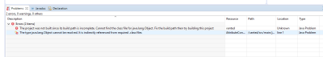
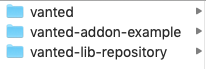

# Building and running vanted from source

author | date
-------|-----
David  | 30.4.

Joshi und Ich konnten seperat von einander die VANTED Kopie im Repository in Eclipse nicht compilieren.
Wir erhielten beide diese Fehlermedlungen:

Ich konnte jedoch einen seperaten download von vanted gemäß dem [Vanted Wiki Eintrag zum Download und der Einrichtung](https://bitbucket.org/vanted-dev/vanted/wiki/Sourcecode.md) compilieren und ausführen.

Das Beispiel Plugin ließ sich bei mir auch nur ausführen, wenn es neben dem vanted-lib-repository und dem vanted Verzeichnis lag.

