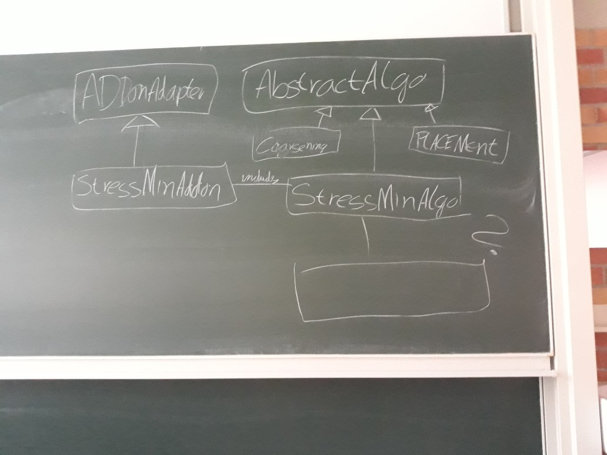

# Protokoll des 2. internen Treffens

Datum | Uhrzeit
------|---------
09.05 | 17:00

- Joshi schreib eine email an Betreuende + Hiwis, dass wir VANTED im Repository nicht zum laufen kriegen.
- Fragen an die Betreuenden schreiben wir in Zukunft in den eingerichteten Discord channel
- Wir erstellen ein Basis Klassendiagram für die Plugininfrastruktur am Beispiel des StressMinimization Plugins: 
- Wir stellen nochmal für alle vor, wie die GUI aussehen soll
- Schwierigkeit bei StressMinimization ist die Implementierung der komplexen Mathematik der Paper => gibt es da Java Frameworks
- Aufgabenverteilung für SDS?
  * zum jetzigen Zeitpunkt schwierig
  * Aufteilung nach StressMin & Multilevel
     - Joshi, Jakob und Benjamin machen StressmMin architekture
     - Thomas, Silvan und David machen Multilevel
-
