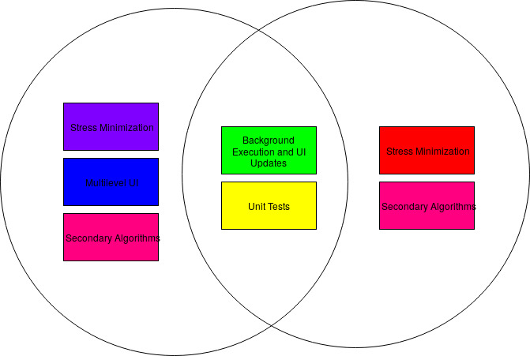

# Protokoll des 4. internen Treffens

Datum | Uhrzeit
------|--------
23.05 | 17:00   

## Zeitplan

Woche | Aufgaben
------|---------
20.5 - 26.5. | Distribute implementation tasks, first generalized input-output implementations to have first ‘hello-world’ algorithm/framework, gui skeleton for testing is finished, define basic unit test cases
27.5. - 9.6. | Implementing first simple real algorithms, defining test cases and benchmarks

## Vorgeschlagene Aufgabenaufteilung:

- bis jetzt ist noch wenig passiert
- nochmal mail wegen benchmarking schreiben

- Background Execution & Ui Updates - allgemeine Algorithmus GUI, wie Force Directed
  * Benjamin
- Stress Minimization
  * David
  * Joshi
- Multilevel Gruppe:
  * Silvan
  * Thomas - GUI
  * Jakob

- API Documentation Guideline
  * Keine @author tags notwendig
  * Zu Public Interfaces (Coarsening, Placement Algorithms): Jede Methode dokumentieren, ausführliche Dokumentation der Interface, Code Beispiel (klein)
  * Internal Interfaces: Short, to the point documentation, class + methods
  * Private helpers / Util classes: Variable names and code should be self documenting, so java-doc may be short, only document important private methods
  * Bei Klassen, die sehr änhlich zu Beispielklassen sind (AddonAdapter) auf Beispiel Addon verweisen, sehr knapp dokumentieren
  * Algorithmus Implementierungen: Als Comment Grundideen aus den Papern restaten, verweißen
  * GUI Klassen für VANTED: Im Code dokumentieren wofür was gemacht wird, wo was im Endeffekt angezeigt wird, Implementierungen im VANTED schwer einsichtig
  * Unit Tests: In Javadoc schreiben, warum dieser Test gemacht wird, welche Fehler / Edge cases gesucht werden / Aufgrund welches Bugs wir den Test eigefügt haben

- Code Style Guide
  * Keine If Statements ohne Klammern (Wir sind nicht bei Apple)!
  * Aussagekräftige Variablen und Methoden Namen
  * Jetzt keine klare Guideline
  * Im allgemeinen Referenz: [Oracle Java Style Guide](https://www.oracle.com/technetwork/java/javase/documentation/codeconventions-142311.html#449)

 - Nächste Woche Donnerstag Feirtag: Wir unterhalten uns nach dem Betreuendentreffen
 - Nächste Woche: Zwei Wochenbericht, Thomas: Ihm nochmal schreiben was wir gemacht haben
